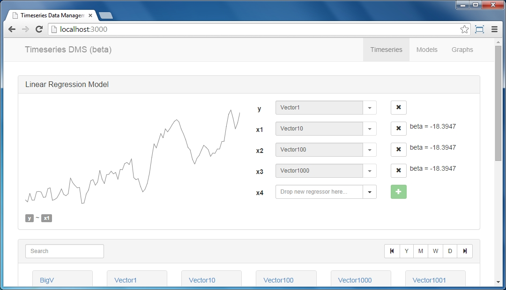
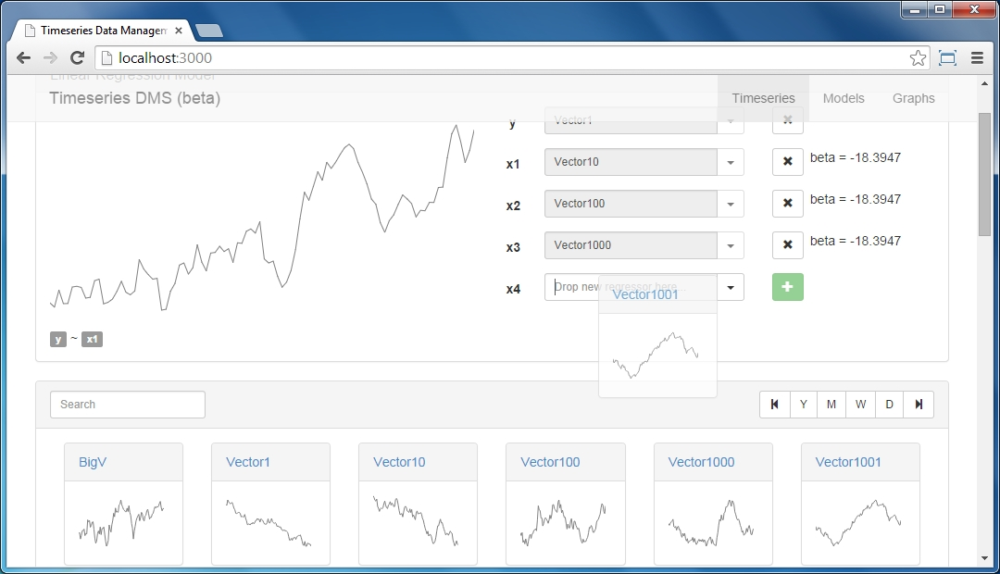
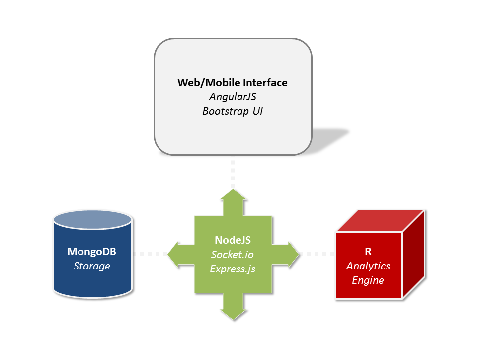
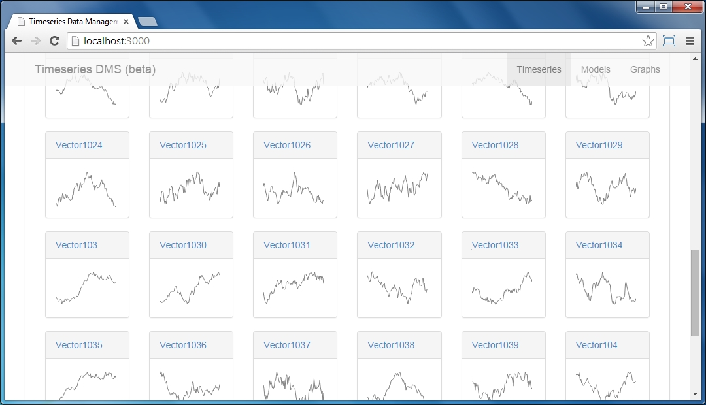

# Protoype: Serious Timeseries Data Analysis #

*An intuitive and fast way to manage and analyze timeseries data*

# Features #

1. Visual way of working with data (great UX!)
2. Super fast backend based on Node.js
3. Based on R as the analytics platform
4. From the ground-up web and mobile (Boostrap UI)

*Drag and drop your timeseries data:*

# Architecture #

Node.js handles REST requests and serves an HTML5 app. MongoDB is used to store timeseries as big vectors (super fast!). At the core is the R engine for data analysis and modeling (connects directly to MongoDB).

# Setup #

This project really is a stub and needs a lot of work still. But here's how you could setup the app:

1. Install R and configure the index.njs to point to your installation.
2. Install MongoDB and create a database "tsdms" with three collections: "triggers", "models", "timeseries".
3. Install NodeJS with the required libraries (see index.njs)
4. Run App by visiting http://localhost:3000/

*Handles many timeseries with ease...*

